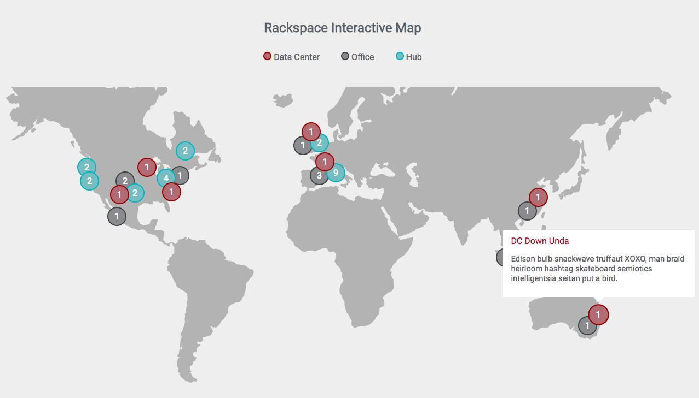

## Rackspace Interactive SVG Map
This is a WIP project that creates a new svg map with custom bubbles/tooltips created from a config using jQuery.



[See Demo](https://0fb555c65f288d09a992-a2085a232a1d2a458a641f48ff12bf08.ssl.cf2.rackcdn.com/rs-jquery-map/index.html)

### Install
```
npm install
```
```
npm start
```
You're browser should automatically launch at localhost 2004.

### API
To initiate the map you need to include the js and css then pass a config of bubbles and the map selector into the init function. Read more on the config further down.
```
<link rel="stylesheet" type="text/css" href="css/main.min.css">
<script src="js/app.min.js" charset="utf-8"></script>

<div class="rsMap-container"></div>

<script type="text/javascript">
  const config = {
    circles: [
      {
        type: 'dataCenter',
        items: 2,
        tipTitle: 'This is a Title',
        tipBody: 'This is some Text',
        tipFooter: 'This is footer text',
        top: '130px',
        left: '130px',
      },
      // ... enter as many as you like
    ]
  };
  rsInteractiveMap.init(config, $('.rsMap-container'));
</script>
```

## Config
The following are options available:
```
type: // String value. The options for this are 'dataCenter', 'office' and 'hub'
items: // Number value. This will represent the number inside the bubble.
tipTitle: // String value. This is the title in the tip, it can accept HTML.
tipBody: // String value. This is the body text in the tip, it can accept HTML.
tipFooter: // String value. This is the footer text in the tip, it can accept HTML.
top: // String value. This is the px value from the top of the map you would like it.
left: // String value. This is the px value from the left of the map you would like it.
```

### Gulp Tasks
Gulp tasks will run automatically but to manually run them:

Build for dist. This will push directly to rackspace cloudfiles as well for static rendering.
```
gulp build-dist
```

Building Javascript: This will concat the js files together in order by name:
```
gulp build-js
```

Building SASS
```
gulp build-sass
```
